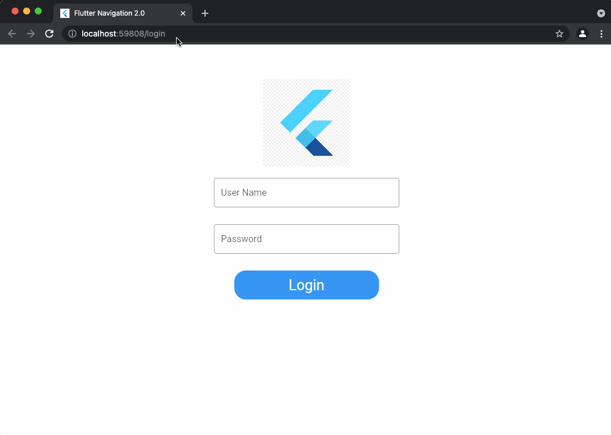
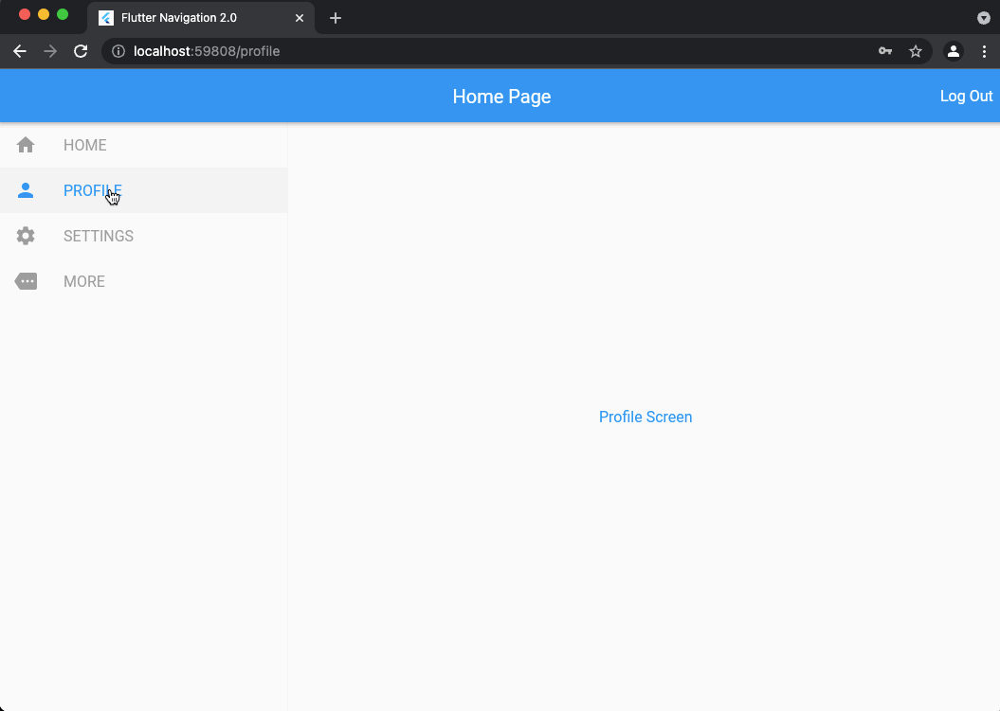
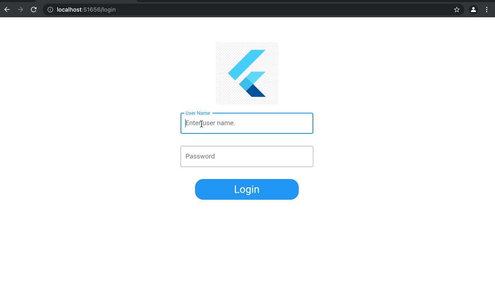

<h1 align="center">Welcome to Flutter Web Navigation 2.0 👋</h1>
<p>
  <a href="http://www.apache.org/licenses/LICENSE-2.0" target="_blank">
    
  </a>
     <a href="https://twitter.com/95Pushkar" target="_blank">
      
    </a>
     <a href="https://twitter.com/ruchikaSjv" target="_blank">
      
    </a>
</p>

The github repository consist of a working example of flutter web routing with private and
protected routes along with params.

  <h1 align="center">Navigator2.0</h1>

<p>Navigator 2.0 uses a declarative style. Understanding Navigator 2.0 involves understanding a few of its concepts such as:</p>
<br>

[<h3><b>Router:</b></h3>](./lib/app.dart) A class that manages opening and closing pages of an application.
The Router widget gets the configuration from the RouteInformationParser and sends it to the RouterDelegate by calling its setNewRoutePath method and asks to the RouterDelegate to build a new Navigator widget according to the current app state.
.

```dart
(new) MaterialApp MaterialApp.router({
  Key? key,
  GlobalKey<ScaffoldMessengerState>? scaffoldMessengerKey,
  RouteInformationProvider? routeInformationProvider,
  required RouteInformationParser<Object> routeInformationParser,
  required RouterDelegate<Object> routerDelegate,
  BackButtonDispatcher? backButtonDispatcher,
  Widget Function(BuildContext, Widget?)? builder,
})
```

[<h3><b>RouteInformationParser:</b></h3>](./lib/routes/route_information_parser.dart) An abstract class used by the Router's widget to parse route information into a configuration. parseRouteInformation will convert the given route information into parsed data to pass to RouterDelegate. </li>

RouteInformation holds location and state information of a route. The location field is a String and it is equivalent to a Web URL.
RouteInformationParser delegate parses the location field of the RouteInformation and returns an instance of a custom-defined data type. The instance of this data type is called a configuration in the design documents because it interprets the current app state.
<br>

```dart
@override
 parseRouteInformation()
```

<h3><b>RouteInformationProvider:</b></h3> An abstract class that provides route information for the Router's widget.

RouteInformationProvider receives the route name String (URL) from the OS.
RouteInformationProvider generates RouteInformation instance from the route name and notifies the Router widget.
The Router widget gets the RouteInformation and passes it to the RouteInformationParser delegate by calling its parseRouteInformation method.

[<h3><b>RouterDelegate:</b></h3>](./lib/routes/route_delegate.dart) An abstract class used by the Router's widget to build and configure a navigating widget.

The role of the RouterDelegate is providing the currentConfiguration to Router widget. Then the Router widget restores the RouteInformation with the help of its RouteInformationParser delegate.

<h3><b>BackButtonDispatcher:</b></h3> Reports to a Router when the user taps the back button on platforms that support back buttons (such as Android).

```dart
class BackButtonListener extends StatefulWidget {
  final Widget child;
  final Future<bool> Function() onBackPressed;

  const BackButtonListener({
    this.child,
    this.onBackPressed,
  });
  @override
  BackButtonListenerState createState()=>BackButtonListenerState();
}

class BackButtonListenerState extends State<BackButtonListener> {

  BackButtonDispatcher dispatcher;
  @override
  void didChangeDependencies() {
    super.didChangeDependencies();
    if (dispatcher != null) {
      dispatcher.removeCallback(widget.onBackPressed);
    }
    dispatcher = Router.of(context)
        .backButtonDispatcher
        .createChildBackButtonDispatcher();
    dispatcher.addCallback(widget.onBackPressed);
    dispatcher.takePriority();
  }

  @override
  Widget build(BuildContext context) {
    return widget.child;
  }
}
```

[<h3><b>TransitionDelegate:</b></h3>](./lib/routes/custom_transition_delegate.dart) The delegate that decides how pages transition in or out of the screen when it's added or removed. However  in most use cases, DefaultTransitionDelegate does a good job with transitions. If you need to handle transitions between pages in customised way, you can create your own delegate by extending TransitionDelegate. </li>

<br>
  <h2 align="center">Demo link</h2>

If you wanna try the app, here you go:

https://finaldemo-89e12.web.app

Please share feedback and if any enhancements are required.
<br><br>

  <h2 align="center">Auth- Private and Protected Routes</h2>


<br>

  <h2 align="center">Routes with custom params</h2>


<br>

 <h2 align="center">Routes with custom transition</h2>


<br>
<br>
<br>
<br>

## Author

👤 **Pushkar Kumar**

- Twitter: [@95Pushkar](https://twitter.com/95Pushkar)
- Github: [@Pushkar952](https://github.com/Pushkar952)
- LinkedIn:
  [@https:\/\/www.linkedin.com\/in\/Pushkar-Kumar\/](https://www.linkedin.com/in/pushkar-kumar-84183091/)

👤 **Ruchika Gupta**

- Twitter: [@ruchikaSjv](https://twitter.com/ulusoyapps)
- Github: [@geekruchika](https://github.com/geekruchika)
- LinkedIn:
  [@https:\/\/www.linkedin.com\/in\/ruchika-gupta\/](https://www.linkedin.com/in/ruchika-gupta-b18946134/)

## Show your support

Give a ⭐️ if this project helped you!

## 📝 License

Copyright © 2020 [Pushkar Kumar](https://github.com/Pushkar952).<br />
This project is
[Apache License, Version 2.0 (the &#34;License&#34;)](http://www.apache.org/licenses/LICENSE-2.0)
licensed.

---

_This README was generated with ❤️ by
[readme-md-generator](https://github.com/kefranabg/readme-md-generator)_
